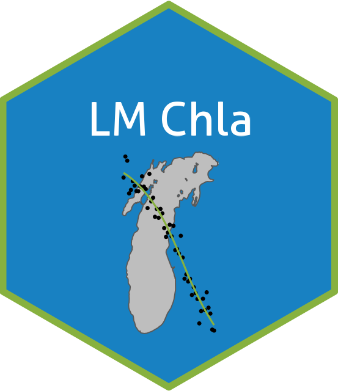

# LM_Chla

This repository contains code to merge Lake Michigan chlorophyll a and predictor data from diverse sources. This repo also contains code to fit models to predict chla.

## General process
In general, this toolbox is meant to aid researchers by reading, cleaning, and joining data from different sources for Lake Michigan. This toolbox does the following (each of which will be documented more thoroughly in the following sections)

- Download data from remote sources (under construction)
- Clean each dataset individually
- Combine into a unified dataset

## Data sources
The data were taken from the following sources

- The Great Lakes Environmental Database, [GLNPO](https://cdx.epmeea.gov/)
- CSMI (hosted locally)
- National Coastal Condition Assessment, [NCCA](https://www.epa.gov/national-aquatic-resource-surveys/ncca)
- National Oceanic and atmospheric Administration, [NOAA](https://www.noaa.gov/)
- [WQP](https://www.waterqualitydata.us/)
- FVCOM (hosted locally)

## Installation 
This is under construction

## Contributing
This is under construction

## License
This is under construction

# Intended use
This data source is intended for ....

## Reccomendations for users
- Use the documentation
- Utilize measurent remarks
- Careful of censored

## Database design
The database was designed using multiple principals that were derived from the design of the LAGOS-US research platform. Firstly, the fundamental sampling unit is defined by a unique spatial position defined by latitude, longitude, and depth. However, since multiple analytes can be measured at each position, but scarcely any position has all analytes measured, the data is arranged in a "long" format where each row represents partial observations indexed by position, time, and analyte. This dramatically reduces the size of the stored data given the data's sparse nature by not introducing large amounts of NA values.

Second, the design is exhaustive given the sourced data. This means that for the chosen data sources, data from all positions, analytes, and periods in time were kept unless they didn't pass a rudimentary quality check (outlined later). This is intended to allow this data source to be a comprehensive resource for researchers who may have specific data needs with respect to time, space, or analytes.

Thirdly, it is designed to be amenable to extensibility and open source development. To this end, rigourous documentation including this user document, principaled database design, open source access on Github, and in depth code commenting and formatting are all with the objective of inviting researchers to extend this work.

Next, we describe the design more in-depth by describing the entities, data model, variables, and schema which together comprise the database.

### Entities
The database includes four entities for which observations occur: lake, site, site/depth, and sample event. Lakes are the set of North American great lakes. A site is defined as a specific location on a lake with a unique Latitude/Longitude defining its position on the surface of the Earth. Site/depth is the depth at which a measurement was taken and together with the site define a unique 3D position for a given measurement. A sample event defines a unique site depth and the point in time which is was measured.

### Data model
The data model describes how entities are related to one another (and linked through common identifiers)......

### Data tables and variables
The <database> is comprised of analyte measurements which are also commonly refered to as features, parameters, or attributes..... We might organize is into multiple different tables when we add more sources...

### Schema
The database contains metadata (analyte descriptions and data column descriptions) along with a datatable. The datatable can be filtered by entities after downloading such as filtering by lake name, lat/lon ranges, site id, or even analyte.. Should we define it as a relational database... keeping the files separate??? 

# Information for <DataBase> Users

## Accessing and using
<database> version 1.0 is made up of multiple utility functions which aid in constructing all or part of the data outlined in this document. Once users install the R package....

## Reccomendations 
- Censored data
- zeros/negatives

## Citation
.....
