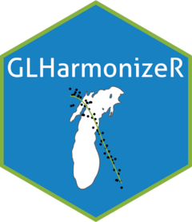

# LMChla 


<!-- badges: start -->
<!--[](https://github.com/kvitense/LM_Chla/actions/workflows/R-CMD-check.yaml)-->
<!-- badges: end -->

This repository contains R functions to merge Lake Michigan Chlorophyll-A (Chla) and predictor data from diverse sources. It also contains workflows for pivoting and imputing the data in preparation for analysis.

# Installation
This package can be install directly from the Github source code as follows.

```r
devtools::github_install("kvitense/LM_Chla")
```

Note: This requires the package "devtools" which can be installed as `r install.packages("devtools")`.


# Aquiring data
This package aids users in getting fully assembled and harmonized water quality data for Lake Michigan in two different ways:

1) Downloading preassembled data
  - From 
  - Accessing after R package install (reccommeded) using `data("lakeMichigan")

Note: That this comes from a frozen realization of the source data and therefore may not be up to date.

2) Assembling using functions provided by the package

```r
df <- assembleData("filepath")
```
- This will save an Rds binary version of the compiled data to the location specified by "filepath"
  - Rds files are loadable using `df <- readRDS("filepath")` in R.


The full documentation is contained [here](docs/UserInfo.md). The sections below link to different sections throughout that document. The documentation is split into different types that target different end users: [general users](#user-documentation) and [developers](#developer-documentation). Additionally, we provide sparse [documentation on the process](#processtechnical-documentation) which we used to develop this software. The documentation was split this way as per suggestion in [this blogpost](https://helpjuice.com/blog/software-documentation).

# Suggested workflows
Suggested workflows (still in development) are included with the package. [These workflows](R/postProcessing.R) provide the ability to:

- Impute censored data based on detection limits
  - starting with data (`df`) in long format
  ```r
  dfimputed <- .dlImputation(df, imputeMethod = "halfMDL")
  ```

- Pivot from long to wide format
  ```r
  dfshort <- .exactPivot(dflong)
  ```
- Impute missing observations based on a nearest neighbor search
- Naively impute remaining missingness using a random forest model

## Intended use
This data source is intended for ....

## Reccomendations for users
- Use the documentation
- Utilize measurent remarks
- Careful of censored
- Report any issues via Github either as a discussion or open an issue

## [General functionality](docs/useNdesign.md)
In general, this toolbox is meant to aid researchers by reading, cleaning, and joining data from different sources for Lake Michigan. This toolbox does the following (each of which will be documented more thoroughly in the following sections)

- Download data from remote sources (under construction)
- Clean each dataset individually
- Combine into a unified dataset
- Provide utilities for processing (imputation etc.)

## Data sources
The data were taken from the following sources

- The Great Lakes Environmental Database, [GLNPO](https://cdx.epmeea.gov/)
  - 1983 - 2023
  - Seabird CTD 2003 - 2023
- CSMI (hosted locally)
  - 2015, 2020 (2010 partially, but too much missing info for inclusion)
- National Coastal Condition Assessment, [NCCA](https://www.epa.gov/national-aquatic-resource-surveys/ncca)
  - 2010, 2015
- National Oceanic and atmospheric Administration, [NOAA](https://www.noaa.gov/)
  - 2007 - 2022
  - CTD 2007 - 2022

## Database design
The database was designed using multiple principals that were derived from the design of the LAGOS-US research platform. Firstly, the fundamental sampling unit is defined by a unique spatial position defined by latitude, longitude, and depth. However, since multiple analytes can be measured at each position, but scarcely any position has all analytes measured, the data is arranged in a "long" format where each row represents partial observations indexed by position, time, and analyte. This dramatically reduces the size of the stored data given the data's sparse nature by not introducing large amounts of NA values.

Second, the design is exhaustive given the sourced data. This means that for the chosen data sources, data from all positions, analytes, and periods in time were kept unless they didn't pass a rudimentary quality check (outlined later). This is intended to allow this data source to be a comprehensive resource for researchers who may have specific data needs with respect to time, space, or analytes.

Thirdly, it is designed to be amenable to extensibility and open source development. To this end, rigourous documentation including this user document, principaled database design, open source access on Github, and in depth code commenting and formatting are all with the objective of inviting researchers to extend this work.

Next, we describe the design more in-depth by describing the entities, data model, variables, and schema which together comprise the database.


# Developer documentation
This section provides additional details that are unnecessary for the general user. That being said, it will not contain all of the high level details that are outlined in the [User Documentation](#user-documentation).

## Contributing
The development environment is managed via "renv". To set up the development environment after cloning the repository run "renv::restore()". This will then ask to install and update packages necesssary for the development environment. If you make changes that alter the environment (i.e. add a new package dependency) please update the renv by running "renv::snapshot()"

For scripts/function organization and style see the [Google r style guide](https://google.github.io/styleguide/Rguide.html). 
For package layout see the [R-exts](https://cran.r-project.org/doc/manuals/R-exts.pdf)
For function documentation [roxygen notes](https://roxygen2.r-lib.org/articles/rd.html)

Lint the project files using R linter package (we are using the default linting choices which enforces tidyverse standards)
```{r}
lintr::lint(filename = "R/filename.R") 
lintr::lint_dir(path = "R")
```

Tags in code are supported to make it easier to search when searching for things to do etc: 
- BUG - if a bug is known to occur from a certain chunk of code
- [ ] - For TODO's
- [x] - to mark that necessary changes are done
- DOCTHIS - highlight sections of code that are important to write up in the documentation for the package
- XXX - Something else of note for developers


## Testing
In order to cut down time tests take to run, tests for a given data source should all be run together. To accomplish this, the data should be stored as a fixture and then tested. Tests are ran through ['testthat' R package](https://testthat.r-lib.org/). Code coverage is provided by [covr](https://covr.r-lib.org/).

# Process/technical documentation 
- Clear to Bottom as NA's
- Assumed if measuring same analyte and method code they were similar
  - assumption was checked by looking at marginal distributions
- Converted silicon to silica
- Assembled positional data from all associated documentation to fill in missing values

### Entities
The database includes four entities for which observations occur: lake, site, site/depth, and sample event. Lakes are the set of North American great lakes. A site is defined as a specific location on a lake with a unique Latitude/Longitude defining its position on the surface of the Earth. Site/depth is the depth at which a measurement was taken and together with the site define a unique 3D position for a given measurement. A sample event defines a unique site depth and the point in time which is was measured.

### Data model
The data model describes how entities are related to one another (and linked through common identifiers)......

### Data tables and variables
The <database> is comprised of analyte measurements which are also commonly refered to as features, parameters, or attributes..... We might organize is into multiple different tables when we add more sources...

### Schema
The database contains metadata (analyte descriptions and data column descriptions) along with a datatable. The datatable can be filtered by entities after downloading such as filtering by lake name, lat/lon ranges, site id, or even analyte.. Should we define it as a relational database... keeping the files separate??? 


## Making changes to namings
Make sure you change all occurences in the Analytes3.xlsx
- Each of the "_Map" sheets
- The "key" sheet

# Citation
.....
