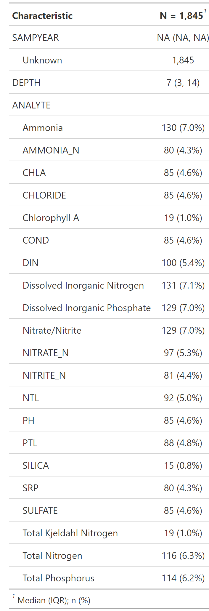
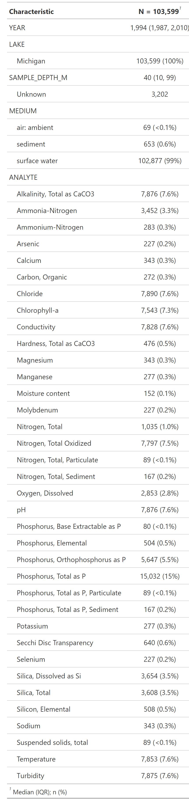

# Data
The data were taken from the following sources. Here we summarize how the data was gathered from each source, the data contained within each source, as well as the cleaning results.

## The Great Lakes Environmental Database, [GLNPO](https://cdx.epmeea.gov/)
Credentials were requested for querying GLENDA (Great Lakes Environmental Database Query System) hosted through the central data exchange by the EPA. We directly queried the database using the GLENDA Query System and based our query off of the following criteria: 

- Select Query: Water Quality Survey Data
- Analyte Code: "Selected every analyte"
- Year: "Select all"
- Season: Blank
- Station: Blank
- Lake: Blank

Data were then downloaded directly using the Query GLENDA Database button. A summary of the dataset after cleaning is shown in the following table 

## National Coastal Condition Assessment, [NCCA](https://www.epa.gov/national-aquatic-resource-surveys/ncca)
NCCA data are downloaded directly from Rscripts using the file locations hosted on the NCCA website. The files are stored as comma separated files and located by filtering by survey choosing all Coastal surveys. Data containing both WaterChem and Site information were downloaded for each year. A summary of the resulting data after cleaning is shown in the following table

## CSMI (hosted locally)

## National Oceanic and atmospheric Administration, [NOAA](https://www.noaa.gov/)

## [WQP](https://www.waterqualitydata.us/)

## FVCOM (hosted locally)

# Analyte information
Analytes were gathered the sources listed above and include any chemical or physical measurements that were taken for a given unique site/time observation. In general, each data source had a unique method of reporting and naming analytes. In order to compile them into a common data source, a common naming convention derived from the Water quality exchange (WQX) database was used as a map.

### Naming convention (mapping to WQX characteristics)
Analytes were matched to WQP entries for CharacteristicName. Those without a direct match or with a partial match (names that matched some subset of Analyte name, especiation, or fraction) were resolved with expert domaing knowledge. Here is a list of Analytes which had partial matches with their suggested names:

- ijaklsdjf
- place holder 

Analyte short names were developed using domain knowledge of common abbreviations used in literature. WQX columns specifying whether the fraction or especiation were needed to simplify these short names when possible.

### Cleaning
- QC types
- Sample types
- method and units screening
- 

### Units convention
- Orders of magnitude check

### Meta data

## Measurement remarks

### Conventions

- Negatives
- Zeros
- Censored (detection limits)
- Combining flags

### Meta data