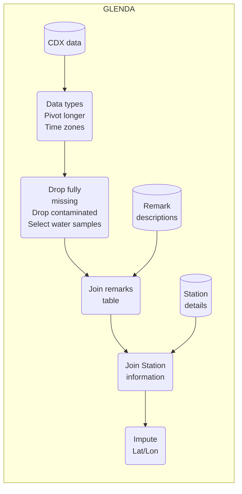
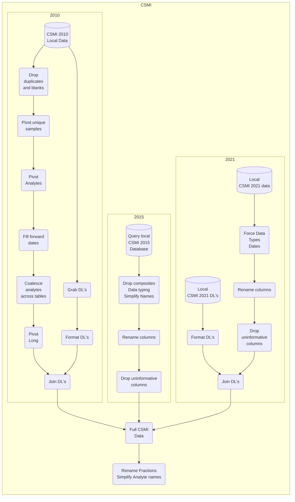
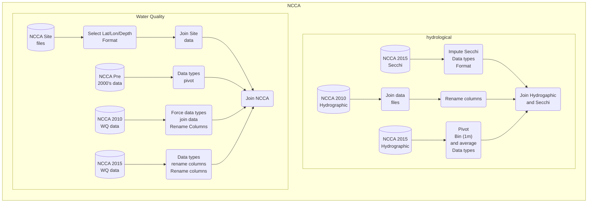

```mermaid
flowchart LR 
  
  subgraph GLENDA
    %% Nodes
    glendaLoad[(CDX data)]

    glendaLoadMeta[(Remark \n descriptions)]

    glendaLoadStation[(Station \n details)]


    glendaformat(Data types \n Pivot longer \n Time zones)

    glendafilter(Drop fully \n missing \n Drop contaminated \n Select water samples)

    glendaMeta(Join remarks \n table)

    glendaStation(Join Station \n information)

    glendaLocationImput(Impute \n Lat/Lon)

    %% Connections
    glendaLoad --> glendaformat --> glendafilter --> glendaMeta --> glendaStation --> glendaLocationImput

    glendaLoadMeta --> glendaMeta
    glendaLoadStation --> glendaStation
  end
```

```mermaid
flowchart LR
  subgraph CSMI
    subgraph 2010
      %% Nodes 
      csmi2010data[(CSMI 2010 \n Local Data)] 
      csmi2010filter(Drop \n duplicates \n and blanks)
      csmi2010pivot1(Pivot unique \n samples)
      csmi2010pivot2(Pivot \n Analytes)
      csmi2010filldates(Fill forward \n dates)
      csmi2010coalesce(Coalesce \n analytes \n across tables)
      csmi2010pivot3(Pivot \n Long)
      csmi2010sepDL(Grab DL's)
      csmi2010DLformat(Format DL's)
      csmi2010joinDLs(Join DL's)
      %% Edges 

      csmi2010data --> csmi2010filter --> csmi2010pivot1 --> csmi2010pivot2 --> csmi2010filldates --> csmi2010coalesce --> csmi2010pivot3 --> csmi2010joinDLs 

      csmi2010data --> csmi2010sepDL --> csmi2010DLformat --> csmi2010joinDLs
    end

    subgraph 2015
      %% Nodes 
      csmi2015DB[(Query local \n CSMI 2015 \n Database)]
      csmi2015format(Drop composites \n Data typing \n Simplify Names)
      csmi2015ColNames(Rename columns)
      csmi2015Drop(Drop uninformative \n columns)


      %% Edges 
      csmi2015DB --> csmi2015format --> csmi2015ColNames --> csmi2015Drop
    end
    subgraph 2021
      %% Nodes
      csmi2021DL[(Local \n CSMI 2021 DL's)]
      csmi2021DLformat(Format DL's)

      csmi2021data[(Local \n CSMI 2021 data)]
      csmi2021types(Force Data \n Types \n Dates)
      csmi2021ColNames(Rename columns)
      csmi2021Drop(Drop \n uninformative \n columns) 
      csmi2021joinDLs(Join DL's)

      %% Edges 
      csmi2021DL --> csmi2021DLformat --> csmi2021joinDLs
      csmi2021data --> csmi2021types --> csmi2021ColNames --> csmi2021Drop --> csmi2021joinDLs
    end

  %% CSMI nodes
  csmiData(Full CSMI \n Data)
  csmiFormat(Rename Fractions \n Simplify Analyte names)

  %% CSMI edges 
  csmi2010joinDLs --> csmiData
  csmi2015Drop --> csmiData
  csmi2021joinDLs --> csmiData
  
  csmiData --> csmiFormat

  end
```

```mermaid 
flowchart LR
  subgraph NCCA
    subgraph hydrological
      %% Nodes
      ncca2015secchi[(NCCA 2015 \n Secchi)]
      ncca2015secchiformat(Impute Secchi \n Data types \n Format)
      
      ncca2010hydro[(NCCA 2010 \n Hydrographic)]
      ncca2010joins(Join data \n files)
      ncca2010hydroformat(Rename columns)

      ncca2015hydro[(NCCA 2015 \n Hydrographic)] 
      ncca2015format("Pivot \n Bin (1m) \n and average \n Data types")

      nccaHydro(Join Hydrogaphic \n and Secchi)

      %% Edges
      ncca2015secchi --> ncca2015secchiformat --> nccaHydro
      ncca2010hydro --> ncca2010joins --> ncca2010hydroformat --> nccaHydro
      ncca2015hydro --> ncca2015format --> nccaHydro
    end

  
    subgraph Water Quality
      %% Nodes
      nccaSites[(NCCA Site \n files)]
      nccaSiteFormat(Select Lat/Lon/Depth \n Format)
      nccaSitejoin(Join Site \n data)

      nccapredata[(NCCA Pre \n 2000's data)]
      nccapreFormat(Data types \n pivot)
      
      nccaWQ2010[(NCCA 2010 \n WQ data)]
      nccaWQ2010format(Force data types \n join data \n Rename Columns)

      nccaWQ2015[(NCCA 2015 \n WQ data)]
      nccaWQ2015format(Data types \n rename columns \n Rename columns)

      nccaJoin(Join NCCA)

      %% Edges
      nccaSites  --> nccaSiteFormat
      nccaSiteFormat --> nccaSitejoin --> nccaJoin

      nccapredata --> nccapreFormat --> nccaJoin
      nccaWQ2010 --> nccaWQ2010format --> nccaJoin
      nccaWQ2015 --> nccaWQ2015format --> nccaJoin
    end
  end


```
