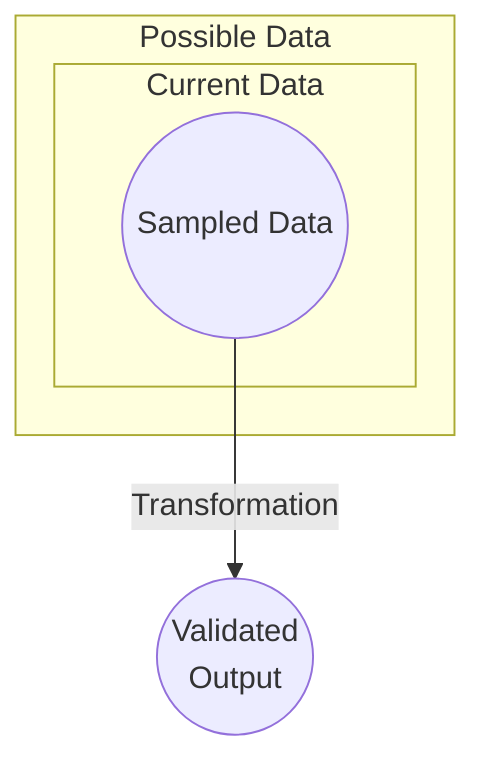
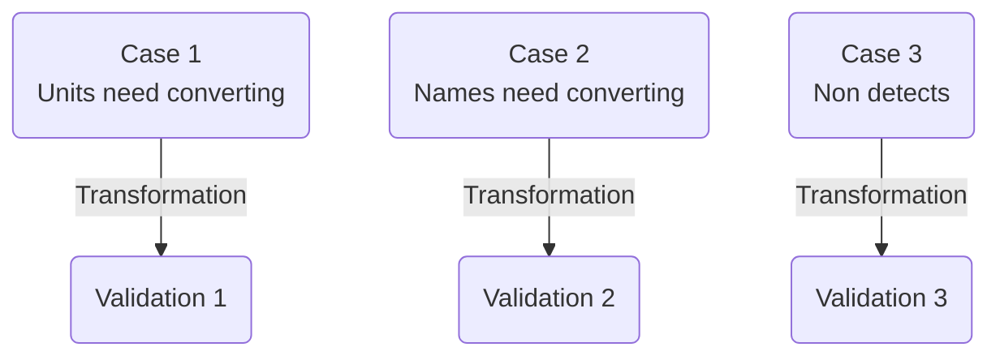

```mermaid
flowchart TB
  subgraph Possible Data

    subgraph Current Data
      sample((Sampled Data))
    end


  end

  sample --Transformation--> validatedOutput((Validated\n Output))

```

```mermaid
flowchart TB
  case1(Case 1 \n Units need converting)
  case2(Case 2 \n Names need converting)
  case3(Case 3 \n Non detects)

  validation1(Validation 1)
  validation2(Validation 2)
  validation3(Validation 3)
  
  case1 --Transformation--> validation1
  case2 --Transformation--> validation2
  case3 --Transformation--> validation3

```
